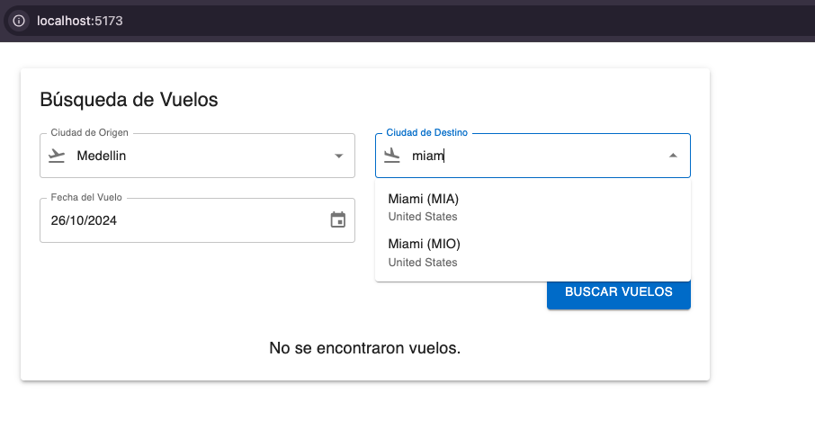
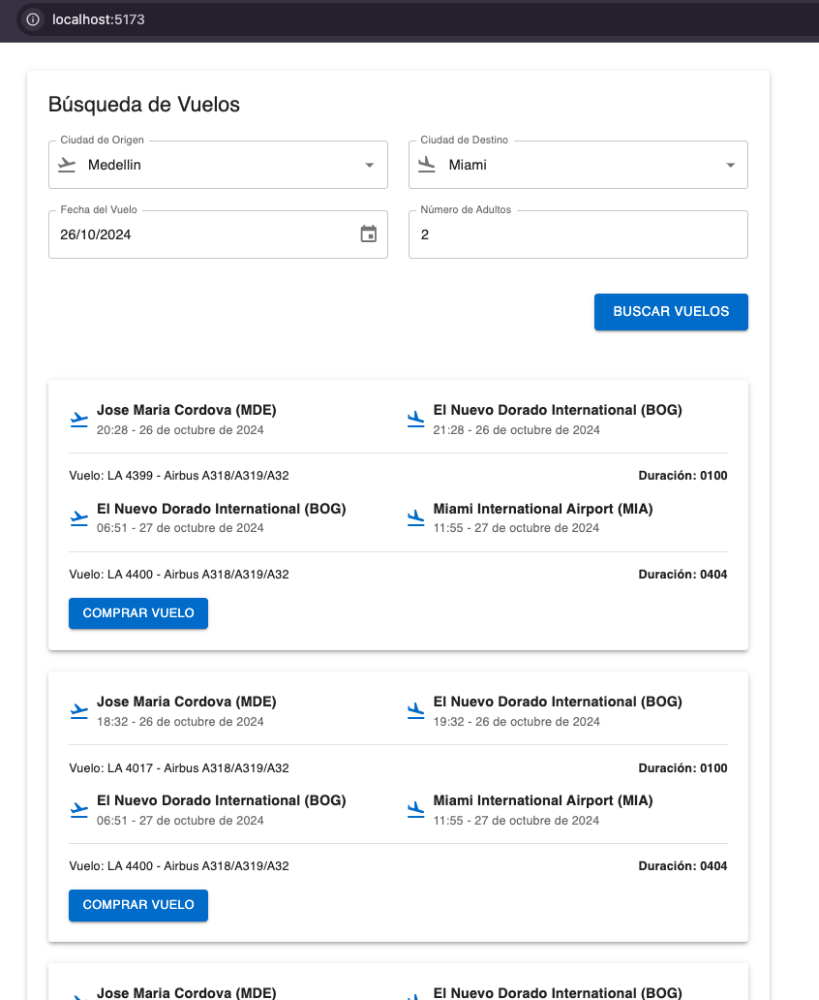
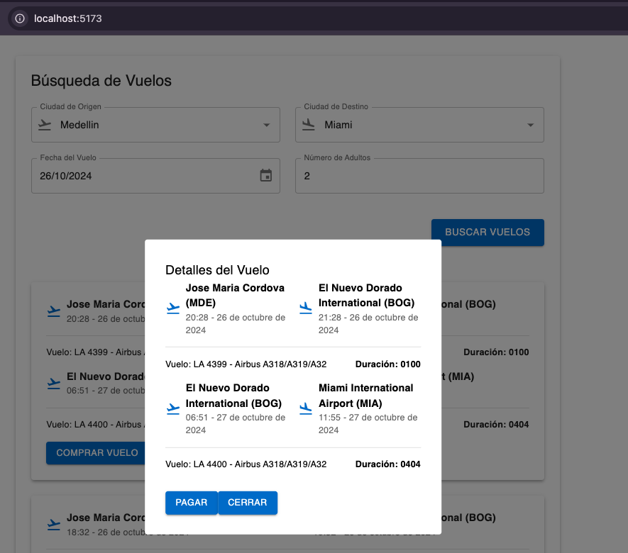
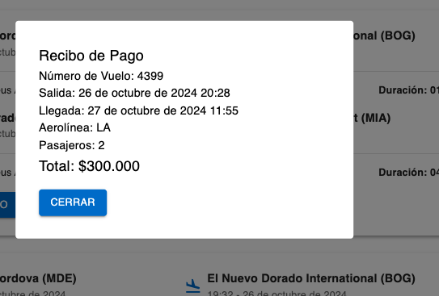

# PRUEBA TECNICA WELLEZY • MELANY PALACIO FONNEGRA

## Descripcion
•⁠  ⁠Realizado con TypeScript y React. Aplicacion web que permite a los usuarios:

- Búsqueda de vuelos aéreos.
- Selección de pasajeros.
- Visualización de detalles de vuelos.
- Modal de confirmación para la compra de vuelos.
- Generación de un recibo de pago tras la compra.

## Tecnologías Utilizadas

- **Frontend:**
  - React.js: Biblioteca para construir la interfaz de usuario.
  - Material-UI: Biblioteca de componentes de React para diseño y estilos.
  - Date-fns: Biblioteca para la manipulación de fechas.

- **Backend:**
  - API propia de vuelos.

  

